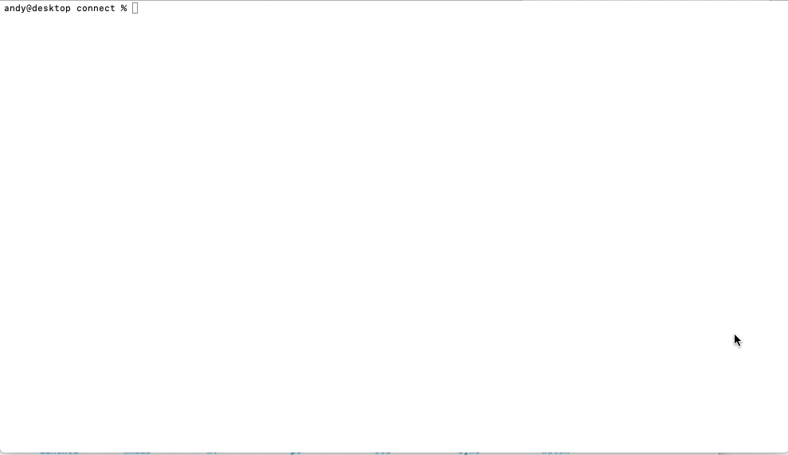

# Command line helper tool for Mutagen 

### Tool to quickly connect to remote peer (Beta) from an Alpha directory

For mutagen see https://github.com/mutagen-io/mutagen

With this tool you can quickly connect from (sub)-directory of Alpha peer to corresponding (sub)-directory of Beta via ssh,
 just my entering command name without providing any arguments.

It covers my most frequent use case: drop a folder from IDE to terminal, type in "connect" and build / test remotely.
 Simple, no need to remember magic shortcuts! Convenient for monorepo when you are deep down the tree. Saves time.

Uses ssh-agent for authentication. Uses native mutagen api for communicating with daemon.

### Demo

